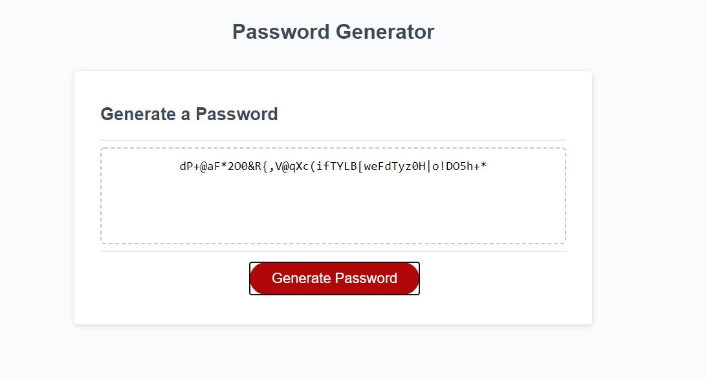

# 03 JavaScript: Password Generator

## Description 

I created an application from base code that enables employees to generate random passwords based on criteria that they’ve selected. This app runs in the browser and features dynamically updated HTML and CSS powered by JavaScript code. It has a responsive user interface that adapts to multiple screen sizes.

The password can include: uppercase letters, lower case letters, numbers, and/or special characters [list of password special characters](https://www.owasp.org/index.php/Password_special_characters) from the OWASP Foundation.

## User Story

```
AS AN employee with access to sensitive data
I WANT to randomly generate a password that meets certain criteria
SO THAT I can create a strong password that provides greater security
```


## Screen Capture

The following screen capture shows my web application's appearance:




## Key Features of this application
* A new secure password is generated when the "generate password" button is clicked
* A series of promps are presented to determine the password criteria from 4 character (uppercase, lowercase, numbers, special characters)
* Application ensures that at least one character set is selected
* Employee is able to select the length of the password (at least 8 characters and no more than 128 characters)
* Application ensures that at least 8 characters and no more than 128 characters are selected
* The password is randomely generated using the combined selected criteria.
* The password is displayed in the text area on the page.


## Deployed application

The URL of the deployed application.
https://ndaruwalla.github.io/password-generator/

## GitHub repository

The URL of the GitHub repository that contains my code.
https://github.com/NDaruwalla/password-generator/
